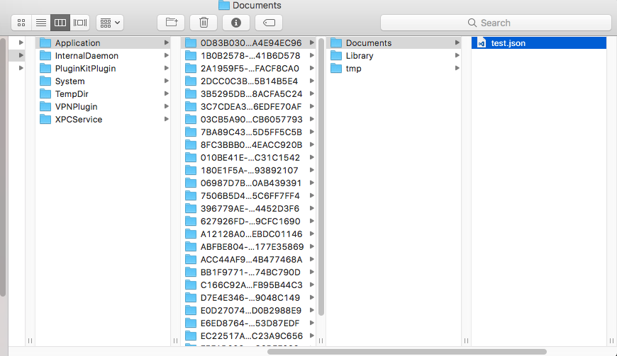

#Find My Simulator
Python script to open finder in iOS simulator documents directory.
Arguments expect device name and document name.

#Example
For this example we will assume the iOS simulator is the iPhone-SE and the document name is "test.json".

####Using Python 3

```shell
$ python simfinder.py -d se -n test.json
```

Upon successfull execution a finder window should open.



#Simulator map

Shortcut | Simulator
------------ | -------------
pro | iPad-Pro
pro9,7 | iPad-Pro--9-7-inch-
air2 | iPad-Air-2'
air | iPad-Air
retina | iPad-Retina
7+ | iPhone-7-Plus
7 | iPhone-7
6s+ | iPhone-6s-Plus
6s | iPhone-6s
6+ | iPhone-6-Plus
6 | iPhone--6
se | iPhone-SE
5s | iPhone-5s
5 | iPhone-5
4s | iPhone-4s
4 | iPhone-4

